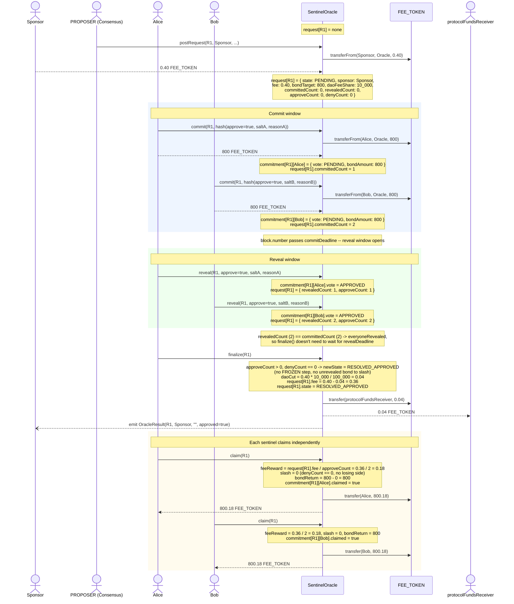

# SentinelOracle Flows

`SentinelOracle` (`contracts/src/SentinelOracle.sol`) resolves a request through a commit/reveal vote among registered sentinels, with the arbitrator as a fallback for split (`FROZEN`) outcomes. This document walks through concrete, worked examples of each flow as sequence diagrams, annotating only the state that matters for understanding what's happening at each step.

Requests move through `SentinelOracleRequest.State`:

```
PENDING -> RESOLVED_APPROVED   (unanimous approve)
PENDING -> RESOLVED_DENIED     (unanimous deny)
PENDING -> FROZEN -> RESOLVED_APPROVED | RESOLVED_DENIED   (split vote, arbitrator rules)
PENDING -> FROZEN -> TIMED_OUT                             (split vote, arbitrator never rules)
PENDING -> TIMED_OUT           (nobody reveals)
```

Each sentinel's individual ballot is tracked separately as a `SentinelOracleCommitment.Commitment` (state machine `NONE -> PENDING -> APPROVED | DENIED`), keyed by `(requestId, sentinel)`.

---

## Flow: Unanimous Approval

Two sentinels — Alice and Bob — both commit and reveal `approve`. Nobody dissents, so `finalize` resolves the request directly to `RESOLVED_APPROVED` with no arbitration step, and every sentinel recovers their full bond plus an equal share of the fee.

**Setup for this example:**

| Parameter | Value |
|---|---|
| `fee` (current governed fee) | 0.40 USDC |
| `bondMultiplier` | 2000 |
| `bondTarget` (= fee × bondMultiplier) | 800 USDC per sentinel |
| `slashAmount` (= fee × slashingMultiplier) | governed separately — unused in this flow, nobody is slashed |
| `daoFeeShare` | 10% (`10_000` / `FEE_SHARE_DENOMINATOR`) |
| sentinels | Alice, Bob (both active) |

Solid arrows (`→`) are contract calls. Dashed arrows (`⇢`) show the resulting ERC20 balance change, directly between the accounts whose balances actually move.



**Outcome:** Sponsor paid 0.40 USDC for the request; the protocol kept its 0.04 USDC DAO cut; Alice and Bob each staked 800 USDC and got back 800.18 (800 bond + 0.18 fee share) — a net profit of 0.18 USDC apiece for agreeing on the correct answer. Nobody was slashed because no dissenting side was ever established (`slashAmountFor` only slashes a revealed vote when it's on the *losing* side of a resolved dispute).
