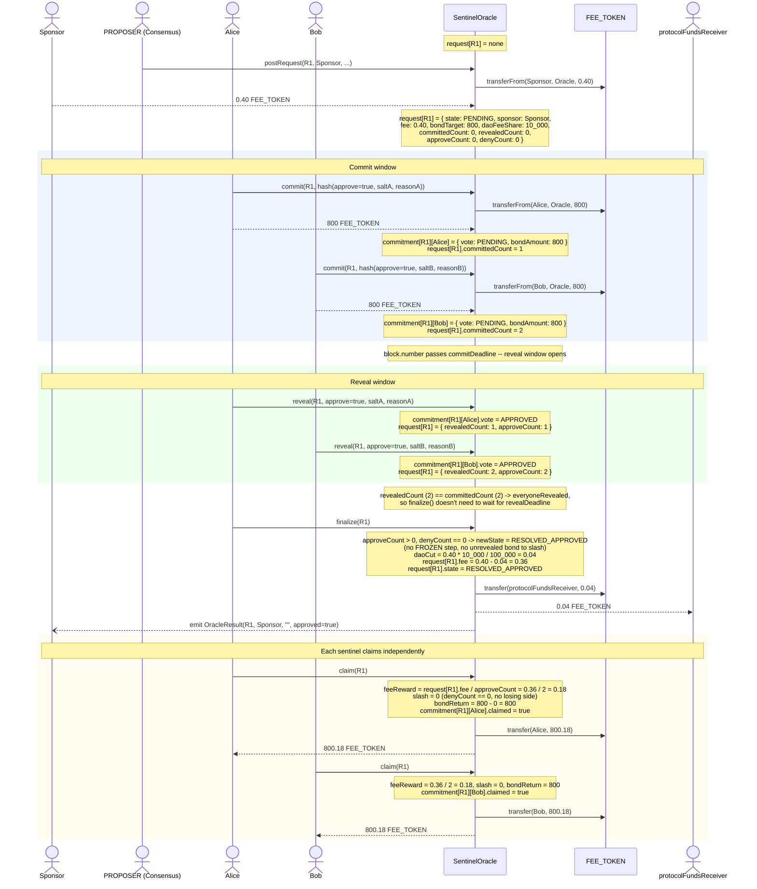
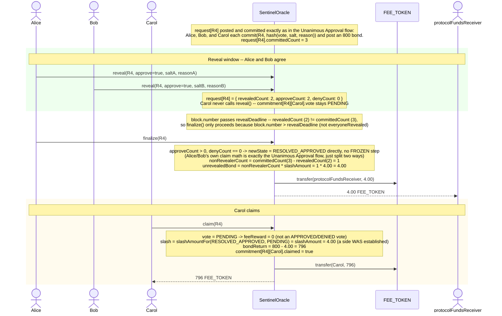
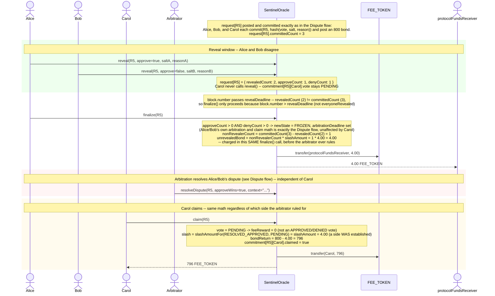
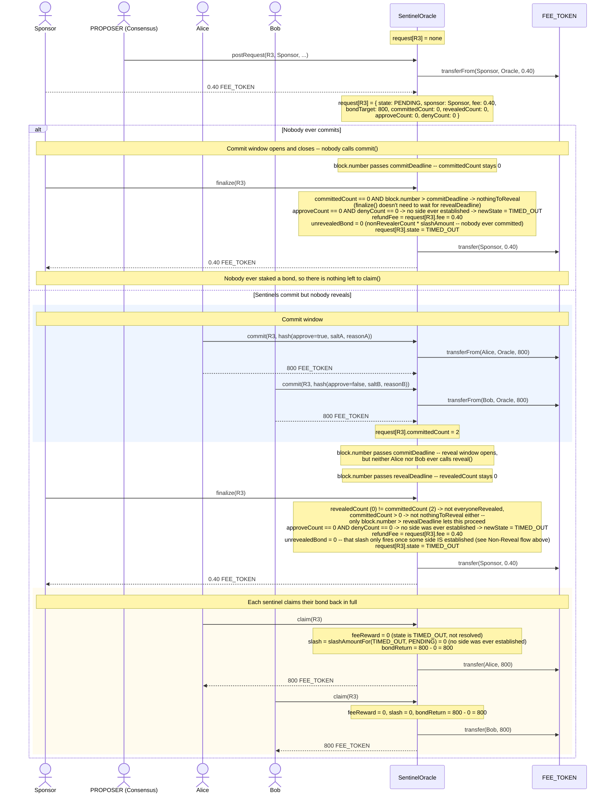

# SentinelOracle Flows

`SentinelOracle` (`contracts/src/SentinelOracle.sol`) resolves a request through a commit/reveal vote among registered sentinels, with the arbitrator as a fallback for split (`FROZEN`) outcomes. This document walks through concrete, worked examples of each flow as sequence diagrams, annotating only the state that matters for understanding what's happening at each step.

Requests move through `SentinelOracleRequest.State`:

```
PENDING -> RESOLVED_APPROVED   (unanimous approve)
PENDING -> RESOLVED_DENIED     (unanimous deny)
PENDING -> FROZEN -> RESOLVED_APPROVED | RESOLVED_DENIED   (split vote, arbitrator rules)
PENDING -> FROZEN -> TIMED_OUT                             (split vote, arbitrator never rules)
PENDING -> TIMED_OUT           (nobody reveals)
```

Each sentinel's individual ballot is tracked separately as a `SentinelOracleCommitment.Commitment` (state machine `NONE -> PENDING -> APPROVED | DENIED`), keyed by `(requestId, sentinel)`.

---

<details>
<summary><h2>Flow: Unanimous Approval</h2></summary>

Two sentinels - Alice and Bob - both commit and reveal `approve`. Nobody dissents, so `finalize` resolves the request directly to `RESOLVED_APPROVED` with no arbitration step, and every sentinel recovers their full bond plus an equal share of the fee.

**Setup for this example:**

| Parameter | Value |
|---|---|
| `fee` (current governed fee) | 0.40 USDC |
| `bondMultiplier` | 2000 |
| `bondTarget` (= fee × bondMultiplier) | 800 USDC per sentinel |
| `slashAmount` (= fee × slashingMultiplier) | governed separately - unused in this flow, nobody is slashed |
| `daoFeeShare` | 10% (`10_000` / `FEE_SHARE_DENOMINATOR`) |
| sentinels | Alice, Bob (both active) |

Solid arrows (`→`) are contract calls. Dashed arrows (`⇢`) show the resulting ERC20 balance change, directly between the accounts whose balances actually move.



**Outcome:** Sponsor paid 0.40 USDC for the request; the protocol kept its 0.04 USDC DAO cut; Alice and Bob each staked 800 USDC and got back 800.18 (800 bond + 0.18 fee share) - a net profit of 0.18 USDC apiece for agreeing on the correct answer. Nobody was slashed because no dissenting side was ever established (`slashAmountFor` only slashes a revealed vote when it's on the *losing* side of a resolved dispute).

</details>

---

<details>
<summary><h2>Flow: Dispute (Split Vote, Arbitrator Rules)</h2></summary>

Two sentinels - Alice and Bob - commit and reveal, but they disagree: Alice reveals `approve`, Bob reveals `deny`. With both sides established, `finalize` can't resolve the request itself, so it freezes it (`FROZEN`) and starts the arbitration clock. The arbitrator later rules for `approve`: the winner (Alice) keeps her bond plus the fee, and the loser (Bob) is slashed.

**Setup for this example:**

| Parameter | Value |
|---|---|
| `fee` (current governed fee) | 0.40 USDC |
| `bondMultiplier` | 2000 |
| `bondTarget` (= fee × bondMultiplier) | 800 USDC per sentinel |
| `slashingMultiplier` | 10 - kept low at launch |
| `slashAmount` (= fee × slashingMultiplier) | 4.00 USDC - charged per sentinel on the losing side of a resolved dispute |
| `daoFeeShare` | 10% (`10_000` / `FEE_SHARE_DENOMINATOR`) |
| sentinels | Alice (approve), Bob (deny) |

Solid arrows (`→`) are contract calls. Dashed arrows (`⇢`) show the resulting ERC20 balance change, directly between the accounts whose balances actually move.

```mermaid
sequenceDiagram
    actor Sponsor
    actor Proposer as PROPOSER (Consensus)
    actor Alice
    actor Bob
    actor Arbitrator
    participant Oracle as SentinelOracle
    participant Token as FEE_TOKEN
    actor DAO as protocolFundsReceiver

    Note over Oracle: request[R2] = none

    Proposer->>Oracle: postRequest(R2, Sponsor, ...)
    Oracle->>Token: transferFrom(Sponsor, Oracle, 0.40)
    Sponsor-->>Oracle: 0.40 FEE_TOKEN
    Note over Oracle: request[R2] = { state: PENDING, sponsor: Sponsor,<br/>fee: 0.40, bondTarget: 800, slashAmount: 4.00, daoFeeShare: 10_000,<br/>committedCount: 0, revealedCount: 0,<br/>approveCount: 0, denyCount: 0 }

    rect rgba(200,220,255,0.3)
        Note over Sponsor,DAO: Commit window
        Alice->>Oracle: commit(R2, hash(approve=true, saltA, reasonA))
        Oracle->>Token: transferFrom(Alice, Oracle, 800)
        Alice-->>Oracle: 800 FEE_TOKEN

        Bob->>Oracle: commit(R2, hash(approve=false, saltB, reasonB))
        Oracle->>Token: transferFrom(Bob, Oracle, 800)
        Bob-->>Oracle: 800 FEE_TOKEN
        Note over Oracle: request[R2].committedCount = 2
    end

    Note over Oracle: block.number passes commitDeadline -- reveal window opens

    rect rgba(200,255,200,0.3)
        Note over Sponsor,DAO: Reveal window
        Alice->>Oracle: reveal(R2, approve=true, saltA, reasonA)
        Note over Oracle: commitment[R2][Alice].vote = APPROVED<br/>request[R2] = { revealedCount: 1, approveCount: 1 }

        Bob->>Oracle: reveal(R2, approve=false, saltB, reasonB)
        Note over Oracle: commitment[R2][Bob].vote = DENIED<br/>request[R2] = { revealedCount: 2, denyCount: 1 }
    end

    Note over Oracle: revealedCount (2) == committedCount (2) -> everyoneRevealed,<br/>so finalize() doesn't need to wait for revealDeadline

    Alice->>Oracle: finalize(R2)
    Note over Oracle: approveCount > 0 AND denyCount > 0 -> newState = FROZEN<br/>(both sides established -- no bonds move here, no fee is cut yet)<br/>request[R2].arbitrationDeadline = block.number + ARBITRATION_TIMEOUT<br/>request[R2].state = FROZEN

    Note over Oracle: finalize() returns early for FROZEN -- no OracleResult event yet,<br/>request now waits on the arbitrator (or ARBITRATION_TIMEOUT, see timeoutArbitration)

    rect rgba(255,220,220,0.3)
        Note over Sponsor,DAO: ArbitraDocument Dispute Flow
        
        Create a mermaid sequence diagram that outlines the dispute flow
tion
        Arbitrator->>Oracle: resolveDispute(R2, approveWins=true, context="...")
        Note over Oracle: losingSideCount = denyCount = 1<br/>slashed = 1 * 4.00 = 4.00<br/>request[R2].state = RESOLVED_APPROVED<br/>refundFee = request[R2].fee = 0.40<br/>daoCut = 0.40 * 10_000 / 100_000 = 0.04<br/>request[R2].fee = 0.40 - 0.04 = 0.36
        Oracle->>Token: transfer(Sponsor, 0.40)
        Oracle-->>Sponsor: 0.40 FEE_TOKEN
        Oracle->>Token: transfer(protocolFundsReceiver, 4.00 - 0.40 + 0.04)
        Oracle-->>DAO: 3.64 FEE_TOKEN
        Oracle--)Sponsor: emit DisputeResolved(R2, RESOLVED_APPROVED, slashed=4.00, context="...")
    end

    rect rgba(255,240,200,0.3)
        Note over Sponsor,DAO: Each sentinel claims independently
        Alice->>Oracle: claim(R2)
        Note over Oracle: feeReward = request[R2].fee / approveCount = 0.36 / 1 = 0.36<br/>slash = slashAmountFor(RESOLVED_APPROVED, APPROVED) = 0 (winner)<br/>bondReturn = 800 - 0 = 800
        Oracle->>Token: transfer(Alice, 800.36)
        Oracle-->>Alice: 800.36 FEE_TOKEN

        Bob->>Oracle: claim(R2)
        Note over Oracle: feeReward = 0 (DENIED vote, RESOLVED_APPROVED outcome -- not eligible)<br/>slash = slashAmountFor(RESOLVED_APPROVED, DENIED) = 4.00 (revealed, on the losing side)<br/>bondReturn = 800 - 4.00 = 796
        Oracle->>Token: transfer(Bob, 796)
        Oracle-->>Bob: 796 FEE_TOKEN
    end
```

**Outcome:** Sponsor paid 0.40 USDC upfront and got the full 0.40 USDC back once the arbitrator ruled - a dispute costs the sponsor nothing; its economics are funded entirely by the losing side's slash. Alice staked 800 USDC and got back 800.36 (800 bond + the whole 0.36 USDC fee pool, since she was the only sentinel on the winning side). Bob staked 800 USDC and got back only 796 - the full 4.00 USDC `slashAmount` for revealing a vote that lost an arbitrated dispute - plus no fee share. The protocol's `protocolFundsReceiver` collected 3.64 USDC, the remainder of Bob's 4.00 USDC slash after the sponsor's refund and the DAO's normal fee cut are carved out of it. Every token the contract ever held across this flow (2 × 800 bond + 0.40 fee = 1600.40) is accounted for by the end: nothing is left stranded in the contract, and nothing is double-spent. `slashAmount` is deliberately small relative to `bondTarget` at launch - a governed parameter that can be raised later once the sentinel set and dispute frequency are better understood.

If the arbitrator never rules, `timeoutArbitration` can be called permissionlessly once `block.number` passes `arbitrationDeadline`: the request moves straight to `TIMED_OUT` (emitting `ArbitrationTimedOut`), the sponsor's fee is refunded, and every sentinel - including Bob - recovers their bond in full via `claim()`, since a timeout (unlike a ruling) establishes no losing side to slash.

The arbitrator can also decline to rule at all by calling `markOutOfScope(R2, context)` - e.g. because the dispute falls outside what they're mandated to arbitrate. This produces the identical `TIMED_OUT` outcome as `timeoutArbitration` (same refund, same full bond recovery via `claim()`), just triggered by the arbitrator's own refusal instead of waiting on `arbitrationDeadline`, and it emits `DisputeOutOfScope(R2, context)` with the arbitrator's rationale instead.

</details>

---

<details>
<summary><h2>Flow: Non-Reveal (Silent Sentinel Alongside an Established Side)</h2></summary>

A third sentinel, Carol, joins Alice and Bob: she commits like everyone else, but never calls `reveal`. Unlike the Timeout flow below, a side over here still gets revealed by *someone* - so `finalize` doesn't time the whole request out, it resolves (or freezes) exactly as in the Unanimous Approval or Dispute flows above, and Carol's silence is handled as a separate, parallel accounting step: an aggregate slash charged inside that same `finalize()` call, well before she ever calls `claim()` herself. This is the only new mechanic here, so both diagrams below elide everything already shown above (postRequest, the mechanics of commit/reveal/claim for the revealing sentinels, arbitration) and focus only on Carol's silent path - first for a request that resolves unanimously, then for one that ends up disputed. Carol's own numbers come out identically either way.

**Setup for this example:**

| Parameter | Value |
|---|---|
| `fee` (current governed fee) | 0.40 USDC |
| `bondMultiplier` | 2000 |
| `bondTarget` (= fee × bondMultiplier) | 800 USDC per sentinel |
| `slashingMultiplier` | 10 |
| `slashAmount` (= fee × slashingMultiplier) | 4.00 USDC |
| `daoFeeShare` | 10% (`10_000` / `FEE_SHARE_DENOMINATOR`) |
| sentinels | Alice (reveals approve), Bob (reveals approve or deny, depending on the case below), Carol (commits, never reveals) |

**Case A - Alice and Bob agree, as in the Unanimous Approval flow:**



**Case B - Alice and Bob disagree, as in the Dispute flow:**



**Outcome:** In both cases Carol loses her full 4.00 USDC `slashAmount` - `slashAmountFor` keys only on whether *any* side was ever established (`approveSentinelCount > 0 || denySentinelCount > 0`), not on which side won or how it was decided. Her aggregate slash is paid out to `protocolFundsReceiver` immediately inside `finalize()` - even before an arbitrator rules, in Case B - while her own reduced `bondReturn` (800 - 4.00 = 796) is only realized later, whenever she calls `claim()` herself; these are two independent halves of the same accounting, not a double charge. Contrast this with the Timeout flow below, where *nobody* reveals: there, no side is ever established, so the identical-looking non-reveal costs nothing.

</details>

---

<details>
<summary><h2>Flow: Timeout (Nobody Votes / Nobody Reveals)</h2></summary>

Not every request reaches a vote. If nobody ever commits, or sentinels commit but nobody reveals, there is no established side for `finalize` to resolve or freeze - the request times out straight from `PENDING` to `TIMED_OUT`, the sponsor's fee is refunded in full, and any sentinel who did commit a bond recovers it in full via `claim`. Both branches below start from the same posted request and diverge only in whether any sentinel ever calls `commit`.

**Setup for this example:**

| Parameter | Value |
|---|---|
| `fee` (current governed fee) | 0.40 USDC |
| `bondTarget` (= fee × bondMultiplier) | 800 USDC per sentinel |
| sentinels | Alice, Bob (both active; only appear in the "nobody reveals" branch) |

Solid arrows (`→`) are contract calls. Dashed arrows (`⇢`) show the resulting ERC20 balance change. `finalize` is permissionless - anyone can call it once its timing condition is met; the Sponsor is shown calling it here purely for convenience.



**Outcome:** Both branches land on `TIMED_OUT` and refund the sponsor's 0.40 USDC fee in full - a timeout costs the sponsor nothing either way. In the "nobody commits" branch, nobody ever staked a bond, so there is nothing to `claim`. In the "nobody reveals" branch, Alice and Bob each staked 800 USDC and get every bit of it back via `claim`: a non-reveal is only punished (the `unrevealedBond` computed inside `finalize`, see the Non-Reveal flow above) when it stalls a request whose outcome was *already* decided by someone else's revealed vote. Here no vote was ever revealed at all, so no side was ever established, and there is no misconduct to prove against a silent committer - `slashAmountFor` only slashes an unrevealed vote once `approveSentinelCount > 0 || denySentinelCount > 0`, which never happens in this flow.

</details>
