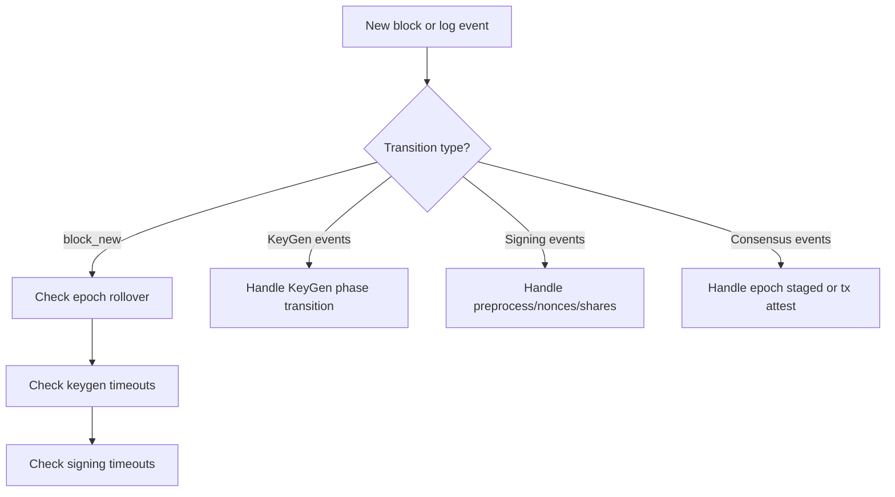
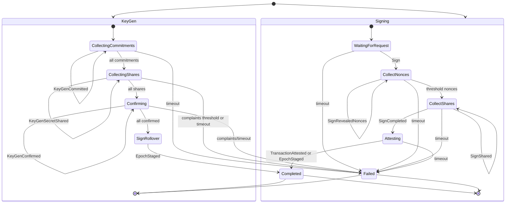

# Safenet Technical Overview

## Coding Agent Instructions:

- Includes a high level description of what Safenet does and what guarantees it provides.
- Describes the changes to the FROST [whitepaper (FROST: Flexible Round-Optimized
Schnorr Threshold Signatures)](./resources/frost.pdf) and [RFC-9591](./resources/rfc9591.txt):
  - Additional confirmation step in keygen, to indicate a participant has no complaints
  - We use the complaint system described in [this paper (Secure Distributed Key Generation for
Discrete-Log Based Cryptosystems)](./resources/dkg.pdf)
  - Preprocess step is used to commit to a chunk of nonces as a time (an optimization for blockchains)
    - Nonces MUST be revealed before hand to prevent Wagner birthday attacks
  - As part of the onchain signing ceremony, we include an additional _selection root_ which groups participants that are signing together
- Our choice of parameters:
  - A threshold that is greater than half the participants, this makes it so all attestations require an absolute majority and you can no longer have competing consensus decisions
  - A minimum group size greater than two thirds, in order to protect against the shrinking quorum attack
- Include high level summaries for each of the state machines (KeyGen and Signing) that includes:
  - how validator participate and communicate onchain
  - What events that they listen to
  - Include exactly one flow chart for the decision tree for the validator
  - Include exactly one state diagram describing the state machine
- Use content from:
  - The contracts from the `contracts/src` directory, focusing on the `contracts/src/Consensus.sol` and `contracts/src/FROSTCoordinator.sol` contracts
  - The validator source code from the `validator/src` directory
  - Additional resources from the `docs/resources` directory
- Note that "shieldnet" is the old name for "safenet", they are the same thing, but always use "safenet"
- ONLY APPEND YOUR OUTPUT TO THIS FILE

---

Write your output here

**Overview**
Safenet is a validator-coordinated attestation network that uses FROST threshold signatures to attest to Safe transactions and epoch rollovers. Validators jointly generate a group key per epoch, run deterministic transaction checks, and produce threshold signatures on-chain through a coordinator and consensus contract. Epochs roll over via a staged handoff where the active validator set signs the next epoch’s group key, and any transaction proposal must be attested with a valid FROST group signature.

**Onchain Components**
- `FROSTCoordinator` orchestrates DKG, nonce preprocessing, signing ceremonies, and signature verification for FROST groups.
- `Consensus` tracks epochs, proposes and stages rollovers, and records transaction attestations. It triggers coordinator signing and verifies signatures via coordinator callbacks.

**Protocol Changes From FROST / RFC-9591**
- Adds an explicit confirmation round in key generation so each participant signals “no complaints” before finalization.
- Uses the complaint system from “Secure Distributed Key Generation for Discrete-Log Based Cryptosystems,” including complaint submission and public response to resolve disputes.
- Adds a preprocessing phase that commits to a chunk of nonces (Merkle root) ahead of time; nonces must be revealed before signing to prevent Wagner birthday attacks.
- Adds a signing “selection root” on-chain, a Merkle root of the selected signing subset, and ties signature shares to that root.

**Parameters**
- Signing threshold is strictly greater than half of the participants, guaranteeing absolute-majority attestations and preventing competing consensus decisions.
- Minimum group size is strictly greater than two thirds of the default validator set, preventing shrinking quorum attacks even under partial dropouts.

**Validator Participation And Onchain Communication**
- KeyGen and signing actions are submitted on-chain via `FROSTCoordinator` calls: `keyGenCommit`, `keyGenSecretShare`, `keyGenConfirm`, `keyGenComplain`, `keyGenComplaintResponse`, `preprocess`, `signRevealNonces`, `signShare`, `signShareWithCallback`.
- Consensus actions are triggered or finalized via `Consensus` calls: `proposeEpoch`, `stageEpoch`, `proposeTransaction`, `attestTransaction`.
- Validators listen to events from both contracts and drive the state machine off logs:
  `KeyGen`, `KeyGenCommitted`, `KeyGenSecretShared`, `KeyGenConfirmed`, `KeyGenComplained`, `KeyGenComplaintResponded`, `Preprocess`, `Sign`, `SignRevealedNonces`, `SignShared`, `SignCompleted`, `EpochProposed`, `EpochStaged`, `TransactionProposed`, `TransactionAttested`.

**KeyGen State Machine Summary**
The KeyGen (epoch rollover) sub-machine coordinates DKG for the next epoch’s group key and then signs the epoch rollover.
- Commitments: validators submit round-1 commitments; once all arrive, the ceremony advances.
- Secret shares: validators submit encrypted shares; complaints can be raised and responded to; too many complaints compromise the group.
- Confirmations: validators confirm successful share verification; unresolved complaints or timeouts can fail the round.
- Rollover signing: the current epoch group signs the new group key; `Consensus` stages the epoch when `FROSTCoordinator` completes signing and calls back.

**Signing State Machine Summary**
The Signing sub-machine produces attestations for Safe transactions or epoch rollover packets.
- Preprocess: validators pre-commit nonce chunks on-chain (Merkle roots) for later use.
- Sign request: a signing ceremony is started for a specific message and group.
- Nonce reveal: each signer reveals its committed nonce pair for the selected sequence.
- Share collection: signers submit FROST signature shares tied to a selection root of the signing subset.
- Attestation: once the group signature is complete, `Consensus` records the attestation for the packet.

**Comprehensive Technical Detail**

**System Guarantees And Threat Model Alignment**
Safenet is designed to provide deterministic, on-chain attestations for Safe transaction proposals and epoch rollovers. The core guarantee is that only a threshold of validators, using a shared FROST group key, can produce attestations recognized by the `Consensus` contract. Liveness can be sacrificed to preserve safety: if the validator set cannot deterministically agree on validity or cannot complete a signing ceremony, the protocol halts on that item rather than attesting incorrect data.

**Consensus And Coordinator Contract Responsibilities**
`Consensus` is the canonical ledger for epochs and attestations. It manages the active, staged, and previous epochs, and records which FROST signatures correspond to epoch rollovers or transactions. It delegates signing to `FROSTCoordinator`, and receives completion callbacks to stage epochs or attest transactions.

`FROSTCoordinator` is the on-chain coordinator for the FROST DKG and signing ceremonies. It maintains the state for each group, enforces ceremony ordering, validates commitments and shares, aggregates signing shares, and emits completion events when a valid group signature is formed.

**Epoch Rollover Lifecycle In `Consensus`**
- A rollover begins when the current epoch set proposes a new epoch with a new group key. `Consensus.proposeEpoch` creates a canonical message using the EIP-712 domain separator and requests a signature from `FROSTCoordinator` on that message.
- Once a signature is formed, `FROSTCoordinator` calls back into `Consensus.onSignCompleted` with a selector-encoded context. If the selector is `stageEpoch`, `Consensus.stageEpoch` verifies the signature via `FROSTCoordinator.signatureVerify`, stores the staged epoch, and records the signature ID.
- The actual rollover is lazy and happens when any state-changing call encounters a block number past the `rolloverBlock`. This updates `previous`, `active`, and clears staged state.

**Transaction Attestation Lifecycle In `Consensus`**
- Anyone can propose a Safe transaction via `Consensus.proposeTransaction` or `Consensus.proposeBasicTransaction`, which emits `TransactionProposed` and requests a signature from the current epoch group.
- Once the signing ceremony completes, `Consensus.attestTransaction` verifies the signature and stores the attestation, making the transaction’s FROST signature retrievable by message hash.

**Coordinator Group Lifecycle And KeyGen Details**
The `FROSTCoordinator` maintains a `Group` struct keyed by `FROSTGroupId` with participant registry, nonce commitment set, group parameters, and the resulting group key.

Group lifecycle states:
- `COMMITTING`: Round 1 commitment broadcasting. Each participant submits a vector of public commitments and a proof of knowledge. This prevents adaptive selection of polynomial coefficients.
- `SHARING`: Round 2 secret share distribution. Each participant submits encrypted shares and their public share. Invalid shares can be contested.
- `CONFIRMING`: Final round. Each participant confirms that shares were valid and that they derived a correct signing share. A complaint system can still disqualify a participant.
- `FINALIZED`: The DKG completes and the group public key is fixed. This group is valid for signing.
- `COMPROMISED`: The ceremony fails due to too many complaints, forcing a restart with a reduced participant set.

**Complaint System Details**
Safenet implements a complaint mechanism derived from the secure DKG paper in `docs/resources/dkg.pdf`. During `SHARING` or `CONFIRMING`, a participant can file a complaint against an accused participant. If the total complaints against an accused meet the threshold, the group is marked compromised and keygen restarts without that participant. An accused participant can respond by revealing the specific secret share publicly, allowing others to verify correctness. This balances accountability with the need to exclude malicious actors.

**Nonce Preprocessing And Wagner Attack Defense**
Safenet adds a two-step preprocessing stage before signing:
- `preprocess` publishes the Merkle root of a chunk of nonce commitments.
- `signRevealNonces` reveals a specific nonce pair with a Merkle proof during signing.
This prevents adaptive nonce selection after the message is known, mitigating Wagner’s birthday attacks. The validator service proactively replenishes nonce commitments when available nonces fall below a threshold.

**Selection Root In Signing**
For every signing ceremony, the set of signers is committed via a Merkle root (`selection root`). Each signature share is bound to this root, and the on-chain `SignShared` event includes it. This ensures that the reconstruction of the final signature is provably tied to the selected signer subset and their Lagrange coefficients.

**Validator Service Architecture**
The validator runs a local state machine that is driven by on-chain events and block progression. It maintains consensus and signing state across epochs and retries. The core entry point is `SafenetStateMachine`, which:
- Consumes block updates and event logs from the watcher pipeline.
- Applies timeout logic for keygen and signing ceremonies.
- Emits protocol actions (on-chain calls) based on state transitions.

**Event Watcher**
The event watcher streams logs from both the `Consensus` and `FROSTCoordinator` contracts. It supports:
- Bloom-filter prechecks for address/topic membership.
- Adaptive paging to mitigate RPC log limits.
- A fallback mode that queries per-event and tolerates configured fallible events.

**KeyGen State Machine Behavior**
The validator’s `rollover` state is advanced by on-chain events:
- `KeyGenCommitted`: validates commitments, then when all are received, computes verification shares and publishes encrypted shares.
- `KeyGenSecretShared`: validates shares, issues complaints for invalid shares, and advances to confirmations when all shares are submitted.
- `KeyGenConfirmed`: when all confirmations are received, it either finalizes genesis (and starts preprocessing) or constructs an epoch rollover packet and enters signing.
- `KeyGenComplained`: tracks complaints and can trigger a full keygen restart without the accused if the complaint threshold is exceeded.
- `KeyGenComplaintResponded`: validates the revealed share; if invalid, it restarts keygen without the accused.
- Timeout handlers remove non-responsive participants and restart keygen with the remaining active set as needed.

**Signing State Machine Behavior**
The signing sub-machine manages attestations for both epoch rollovers and Safe transactions.
- `Sign` (request): starts a signing ceremony after verifying the packet message hash.
- `SignRevealedNonces`: collects nonce commitments and transitions to share collection when the threshold is met.
- `SignShared`: collects signature shares; once a valid aggregate is complete, `FROSTCoordinator` emits `SignCompleted`.
- `SignCompleted`: transitions to `waiting_for_attestation`, expecting a `Consensus` update (epoch staged or transaction attested).
- Timeouts: drop or retry ceremonies with reduced signers or new responsibilities; re-issue signing requests if necessary.

**Genesis Flow Specifics**
Genesis keygen is a special case where the group context cannot include the consensus address (chicken-and-egg). Instead, the context is derived from a `genesisSalt`. Once genesis keygen confirms, validators immediately preprocess nonce commitments and set the rollover state to `epoch_staged` for epoch 0.

**Consensus Verification Engine**
Validator verification is deterministic and enforced before signing:
- `SafeTransactionHandler` parses and validates the Safe transaction packet schema, runs the configured check set, and hashes the packet into a canonical message.
- `EpochRolloverHandler` validates rollover packet structure and hashes it into a canonical message.
- Verified packet IDs are cached so only verified messages can trigger signing actions.

**Safe Transaction Validation Checks**
Safenet’s validation logic is deterministic and policy-driven. The check framework includes:
- No delegatecall enforcement.
- Selector-level allowlists for Safe self-calls.
- Address- and chain-specific checks using deterministic schemas.
These checks are combined to form a single deterministic verdict for “valid” vs “invalid,” and only valid packets proceed to signing.

**State Persistence And Local Storage**
The validator stores:
- Group membership, thresholds, and public keys.
- Secret signing shares and nonce commitment trees.
- Pending signing requests and mapping from signature IDs to messages.
This persistence enables retry logic and graceful recovery from timeouts or RPC disruptions.

**Deterministic Safety Over Liveness**
The validator state machine will drop or stall a signing request if:
- The packet fails deterministic verification.
- There are insufficient signers to meet the threshold.
- Keygen or signing timeouts reduce the available signer set below threshold.
This is by design to avoid attesting invalid state or ambiguous outcomes.

**Key Protocol Messages**
- Epoch rollover message: EIP-712 domain plus `activeEpoch`, `proposedEpoch`, `rolloverBlock`, and the new group public key.
- Safe transaction message: EIP-712 domain plus the proposed transaction fields.
All message hashes used for FROST signing are deterministic and derived from verified packet schemas.

**Onchain Action Mapping**
Validator protocol actions map directly to on-chain calls:
- KeyGen: `keyGenAndCommit`, `keyGenCommit`, `keyGenSecretShare`, `keyGenConfirm`, `keyGenConfirmWithCallback`, `keyGenComplain`, `keyGenComplaintResponse`.
- Preprocess and signing: `preprocess`, `sign`, `signRevealNonces`, `signShare`, `signShareWithCallback`.
- Consensus finalization: `stageEpoch`, `attestTransaction`.
These actions are queued and executed with retry-safe nonce tracking.

**Epoch And Signing Timeouts**
- Keygen timeouts remove non-participating or non-responding validators and restart the ceremony.
- Signing timeouts can:
  - Reassign responsibility to all signers.
  - Reduce signer sets to active participants only.
  - Re-issue signing requests when a quorum remains.
  - Drop requests if the signer set falls below threshold.

**Summary Of Contract Events And Their Roles**
- `KeyGen`, `KeyGenCommitted`, `KeyGenSecretShared`, `KeyGenConfirmed`: drive the DKG lifecycle.
- `KeyGenComplained`, `KeyGenComplaintResponded`: enforce accountability and trigger restarts if needed.
- `Preprocess`: records nonce commitment chunks.
- `Sign`, `SignRevealedNonces`, `SignShared`, `SignCompleted`: drive signing ceremonies and completion.
- `EpochProposed`, `EpochStaged`: record rollover steps in `Consensus`.
- `TransactionProposed`, `TransactionAttested`: record Safe transaction attestation lifecycle.

**Implementation Notes**
- The system uses absolute majority thresholds (`threshold > n/2`) and minimum participant size (`> 2/3` of default participants) to prevent competing majorities and shrinking quorum attacks.
- The validator uses deterministic verification and strict schema checks before any signature is requested.
- Keygen restarts are triggered automatically when complaints or timeouts indicate an unsafe or incomplete ceremony.

**File Pointers**
- Onchain: `contracts/src/Consensus.sol`, `contracts/src/FROSTCoordinator.sol`.
- Validator state machine: `validator/src/service/machine.ts` and `validator/src/machine/*`.
- Verification: `validator/src/consensus/verify/*`.
- Signing: `validator/src/consensus/signing/*`.
- KeyGen: `validator/src/consensus/keyGen/*`.
- Events: `validator/src/types/abis.ts` and `validator/src/watcher/*`.
