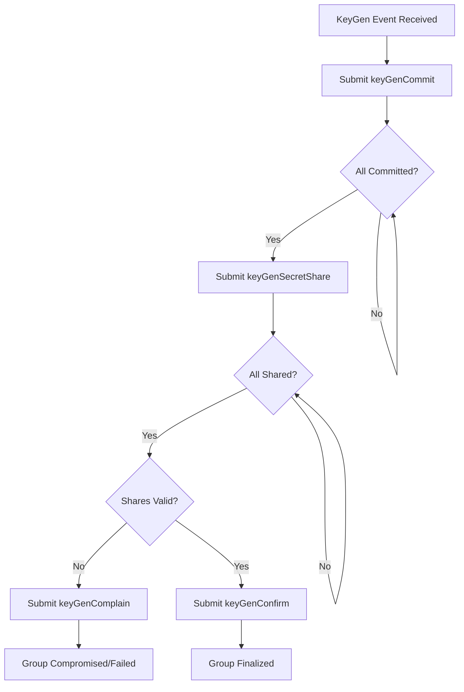
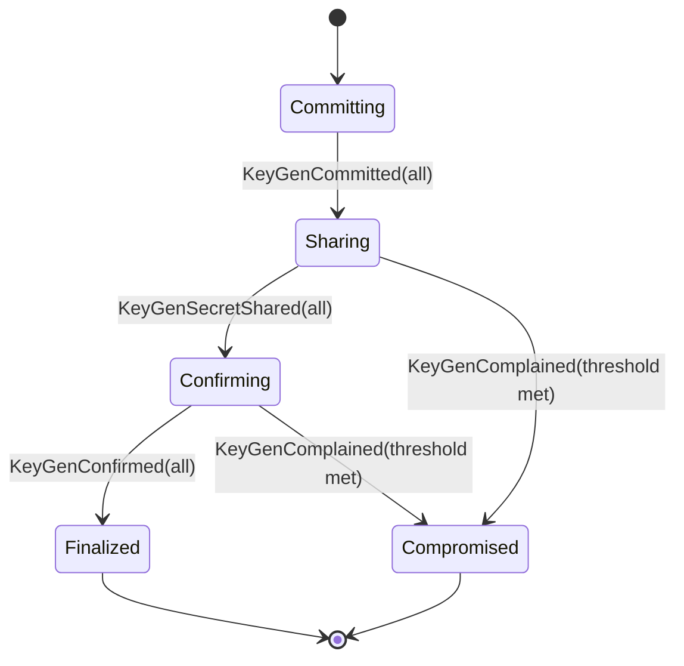
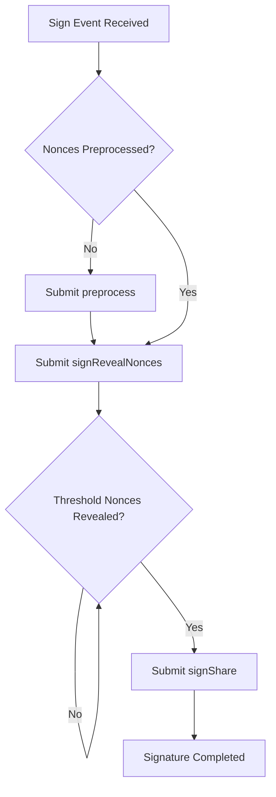
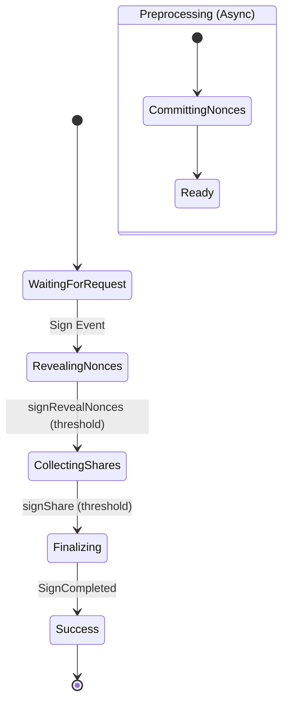

# Safenet Technical Overview

## Coding Agent Instructions:

- Includes a high level description of what Safenet does and what guarantees it provides.
- Describes the changes to the FROST [whitepaper (FROST: Flexible Round-Optimized
Schnorr Threshold Signatures)](./resources/frost.pdf) and [RFC-9591](./resources/rfc9591.txt):
  - Additional confirmation step in keygen, to indicate a participant has no complaints
  - We use the complaint system described in [this paper (Secure Distributed Key Generation for
Discrete-Log Based Cryptosystems)](./resources/dkg.pdf)
  - Preprocess step is used to commit to a chunk of nonces as a time (an optimization for blockchains)
    - Nonces MUST be revealed before hand to prevent Wagner birthday attacks
  - As part of the onchain signing ceremony, we include an additional _selection root_ which groups participants that are signing together
- Our choice of parameters:
  - A threshold that is greater than half the participants, this makes it so all attestations require an absolute majority and you can no longer have competing consensus decisions
  - A minimum group size greater than two thirds, in order to protect against the shrinking quorum attack
- Include high level summaries for each of the state machines (KeyGen and Signing) that includes:
  - how validator participate and communicate onchain
  - What events that they listen to
  - Include exactly one flow chart for the decision tree for the validator
  - Include exactly one state diagram describing the state machine
- Use content from:
  - The contracts from the `contracts/src` directory, focusing on the `contracts/src/Consensus.sol` and `contracts/src/FROSTCoordinator.sol` contracts
  - The validator source code from the `validator/src` directory
  - Additional resources from the `docs/resources` directory
- Note that "shieldnet" is the old name for "safenet", they are the same thing, but always use "safenet"
- ONLY APPEND YOUR OUTPUT TO THIS FILE

---

## Introduction

Safenet is a high-security threshold signature protocol and consensus layer designed to provide deterministic attestations for blockchain transactions and epoch rollovers. By leveraging Flexible Round-Optimized Schnorr Threshold (FROST) signatures, Safenet ensures that a distributed set of validators can collectively sign off on data without any single participant possessing the full private key.

### Core Guarantees

*   **Safety over Liveness:** Safenet prioritizes the correctness of attestations. If the network cannot reach a consensus or if malicious activity is detected beyond the fault tolerance limit, the protocol will halt rather than produce an invalid attestation.
*   **Deterministic Validation:** All honest validators follow 100% deterministic logic. This ensures that any two honest nodes will always agree on the validity of a transaction, minimizing the surface area for Byzantine attacks.
*   **Byzantine Fault Tolerance:** The protocol is designed to be resilient against up to 1/3 of the validator set being malicious or offline, provided that the remaining honest majority acts deterministically.

## FROST & DKG Enhancements

Safenet implements several critical modifications to the standard FROST ([RFC-9591](https://datatracker.ietf.org/doc/html/rfc9591)) and Distributed Key Generation (DKG) protocols to enhance security and onchain efficiency.

### 1. DKG Complaint System
Following the "Secure Distributed Key Generation for Discrete-Log Based Cryptosystems" paper, Safenet incorporates a robust complaint system. If a participant receives invalid secret shares during the KeyGen process, they can submit an onchain complaint. This forces the accused participant to either reveal the share publicly to prove its correctness or be disqualified, potentially compromising the group if the threshold of misbehavior is met.

### 2. KeyGen Round 3: Confirmation
Unlike standard DKG which ends after secret sharing, Safenet introduces a final **Confirmation** step. Participants must explicitly confirm onchain that they have received valid shares and have no outstanding complaints. This ensures that a group key is only finalized when all participants are ready to sign.

### 3. Nonce Preprocessing & Wagner Attack Prevention
To optimize for blockchain latency, Safenet uses a `preprocess` step where validators commit to a large chunk (e.g., 1024) of nonce pairs at once. 
*   **Merkle Commitments:** Validators submit a Merkle root of their nonce commitments onchain.
*   **Pre-reveal Requirement:** The actual public nonces must be revealed (`signRevealNonces`) *before* signature shares are submitted but *after* the message is known. However, because the Merkle root was committed *before* the message was proposed, participants cannot adaptively change their nonces, effectively preventing Wagner’s Birthday Attack.

### 4. Selection Roots
During the onchain signing ceremony, a `selectionRoot` is used. This is a Merkle root representing the specific subset of validators participating in a given signing ceremony. This allows the contract to efficiently verify Lagrange coefficients and ensure only authorized signers contribute to the final group signature.

## Protocol Parameters

Safenet carefully selects its parameters to maximize security:
*   **Threshold ($t > n/2$):** By requiring more than half of the participants to sign, Safenet ensures that only one valid consensus decision can exist at any time, preventing forks or competing attestations.
*   **Minimum Group Size ($n > 2/3 \cdot N_{total}$):** To protect against the **Shrinking Quorum Attack**, Safenet requires that the active validator set must always be greater than two-thirds of the total registered participants. This prevents an attacker from forcing honest nodes offline to gain control of a smaller, compromised quorum.

---

## State Machine: Key Generation (KeyGen)

The KeyGen state machine handles the creation of a new FROST group key for a specific epoch.

### Validator Participation
Validators participate by listening to the `KeyGen` event and then sequentially submitting their commitments, secret shares, and finally confirming the group.

*   **Events Listened To:** `KeyGen`, `KeyGenCommitted`, `KeyGenSecretShared`, `KeyGenComplained`, `KeyGenConfirmed`.
*   **Onchain Communication:** `keyGenCommit`, `keyGenSecretShare`, `keyGenComplain`, `keyGenConfirm`.

### Decision Tree

### State Diagram

---

## State Machine: Signing

The Signing state machine produces a FROST group signature for a proposed transaction or epoch rollover.

### Validator Participation
Validators must have previously preprocessed nonces. When a `Sign` request is detected, they reveal the specific nonces for that session and then submit their signature shares.

*   **Events Listened To:** `Sign`, `SignRevealedNonces`, `SignShared`, `SignCompleted`.
*   **Onchain Communication:** `preprocess`, `signRevealNonces`, `signShare`.

### Decision Tree

### State Diagram

