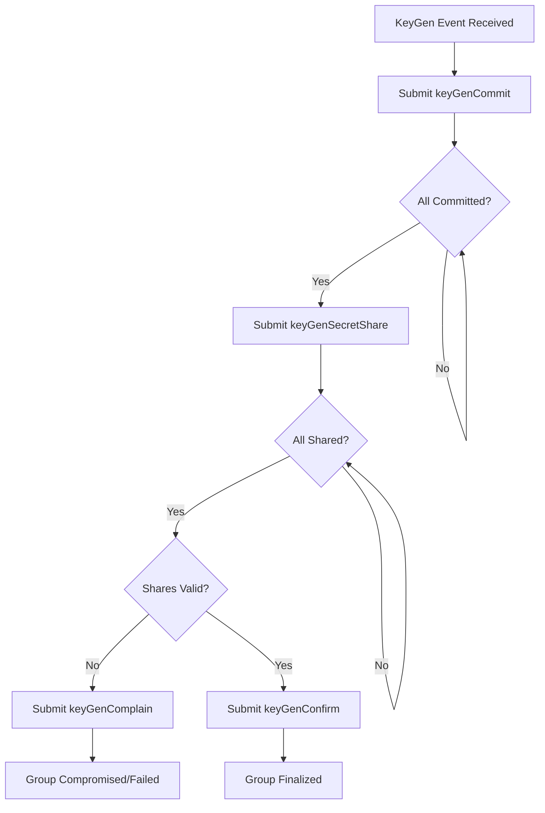
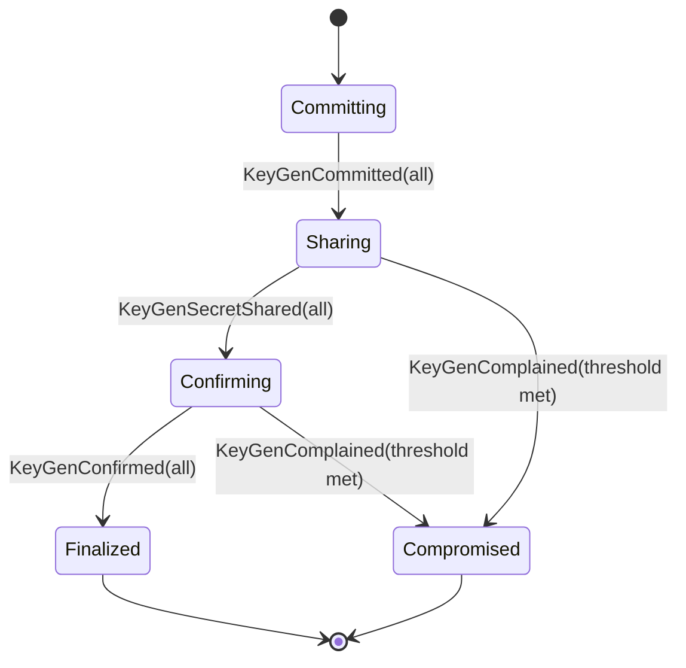
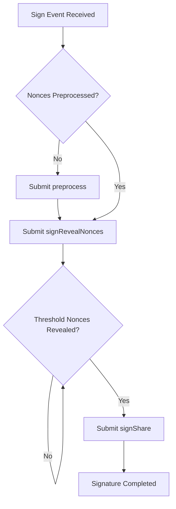
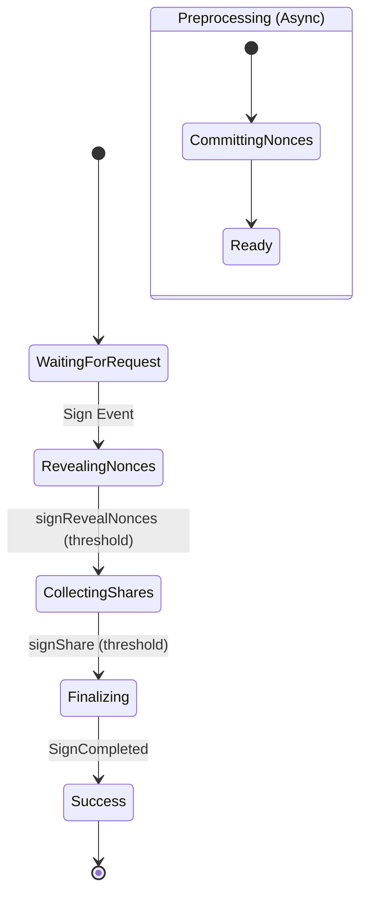

### 3. Nonce Preprocessing & Wagner Attack Prevention
To optimize for blockchain latency, Safenet uses a `preprocess` step where validators commit to a large chunk (e.g., 1024) of nonce pairs at once.
*   **Merkle Commitments:** Validators submit a Merkle root of their nonce commitments onchain.
*   **Pre-reveal Requirement:** The actual public nonces must be revealed (`signRevealNonces`) *before* signature shares are submitted but *after* the message is known. However, because the Merkle root was committed *before* the message was proposed, participants cannot adaptively change their nonces, effectively preventing Wagner’s Birthday Attack.

### 4. Selection Roots
During the onchain signing ceremony, a `selectionRoot` is used. This is a Merkle root representing the specific subset of validators participating in a given signing ceremony. This allows the contract to efficiently verify Lagrange coefficients and ensure only authorized signers contribute to the final group signature.

## Protocol Parameters

Safenet carefully selects its parameters to maximize security:
*   **Threshold ($t > n/2$):** By requiring more than half of the participants to sign, Safenet ensures that only one valid consensus decision can exist at any time, preventing forks or competing attestations.
*   **Minimum Group Size ($n > 2/3 \cdot N_{total}$):** To protect against the **Shrinking Quorum Attack**, Safenet requires that the active validator set must always be greater than two-thirds of the total registered participants. This prevents an attacker from forcing honest nodes offline to gain control of a smaller, compromised quorum.

---

## State Machine: Key Generation (KeyGen)

The KeyGen state machine handles the creation of a new FROST group key for a specific epoch.

### Validator Participation
Validators participate by listening to the `KeyGen` event and then sequentially submitting their commitments, secret shares, and finally confirming the group.

*   **Events Listened To:** `KeyGen`, `KeyGenCommitted`, `KeyGenSecretShared`, `KeyGenComplained`, `KeyGenConfirmed`.
*   **Onchain Communication:** `keyGenCommit`, `keyGenSecretShare`, `keyGenComplain`, `keyGenConfirm`.

### Decision Tree

### State Diagram

---

## State Machine: Signing

The Signing state machine produces a FROST group signature for a proposed transaction or epoch rollover.

### Validator Participation
Validators must have previously preprocessed nonces. When a `Sign` request is detected, they reveal the specific nonces for that session and then submit their signature shares.

*   **Events Listened To:** `Sign`, `SignRevealedNonces`, `SignShared`, `SignCompleted`.
*   **Onchain Communication:** `preprocess`, `signRevealNonces`, `signShare`.

### Decision Tree

### State Diagram

