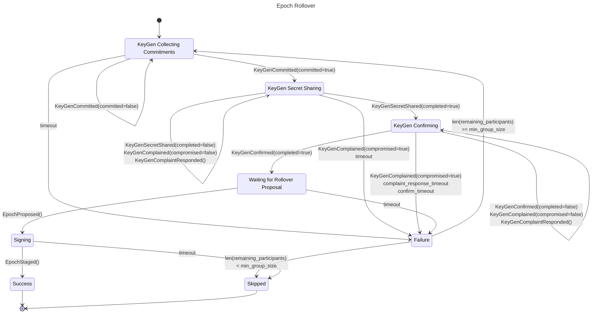
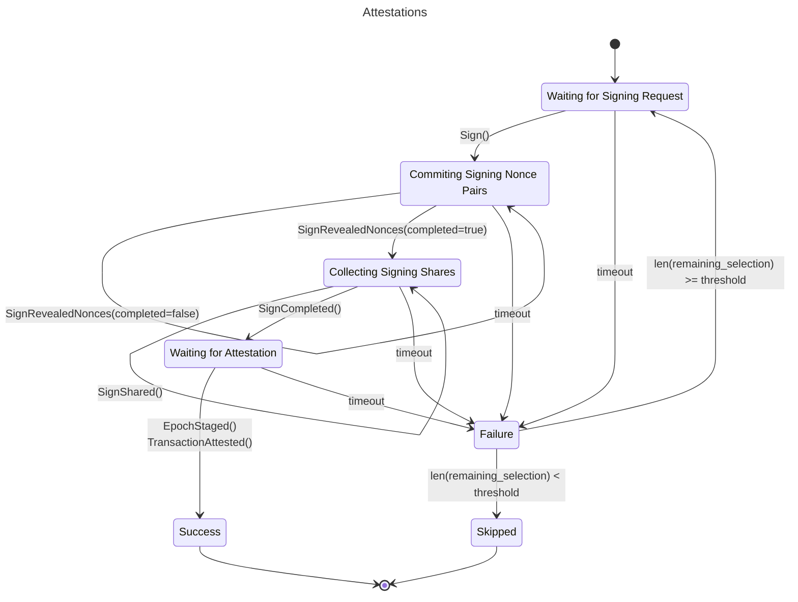

# Safenet Technical Overview

Safenet is a decentralized Safe transaction security network, where validators coordinate to generate cryptographic attestations that ensure some base level of transaction security, preventing whole categories of multisig hacks.

## Network Guarantees

Safenet has a Byzantine Fault Tolerance of 1/3, meaning we assume that fewer than 1/3 of the complete validator set will act dishonestly and not follow the rules. Under this assumption, Safenet guarantees that:

- No invalid transaction attestation will ever be produced.
- The network will never rollover into an epoch with a dishonest majority.

### Deterministic Checks

Safenet validators only ever attest to 100% deterministic outcomes. This is an important property of our network, as it ensures that honest nodes always agree, allowing it to maintain its security guarantees up to the network's Byzantine Fault Tolerance. **For the beta version of Safenet, this implies that Safe transaction validity is completely deterministic and limited to only what is included in the transaction data.**

In the future, we want Safenet to create economic incentives for _transaction checkers_ to provide real-time security information to Safe accounts. This information is inherently non-deterministic meaning that it cannot be provided by validators themselves. Instead, Safenet will open markets, where the transaction checkers participate as sophisticated market makers, to compete on providing the best possible security information to Safe users. Validators would then attest to how the market resolves, instead of attesting to the security of the transaction itself. The exact mechanism by which this will work is still in early development.

### Onchain Communication

For the initial beta release, Safenet validators communicate entirely onchain:

- It must be on a chain with has low gas fees, making it relatively cheap from an operational standpoint, despite the communication being onchain.
- Onchain communication provides the protocol with absolute ordering of messages as well as a global "clock" that validators can rely on for deterministic timeouts.
- Reduces the operational complexity of running a validator, as you do not need to expose a service to the scary internet.
- Users can directly interact with Safenet by executing transactions on a block explorer.
- Decreases the barrier to entry for implementing Safenet clients: all you need is an RPC node.

That being said, **onchain communication does not scale well with a large number of validators.** (in fact, it scales quadratically[^scale] with the number of validators). In the future, Safenet will have its own peer-to-peer network enabling much larger validator sets.

#### `Consensus` Contract

The consensus contract is responsible for tracking the current epoch, as well as providing an interface for clients to request attestations to Safe transactions.

#### `FROSTCoordinator` Contract

The coordinator contract is responsible for coordinating and verifying the various cryptographic protocols required by the Safenet consensus contract.

## FROST

The Flexible Round-Optimized Schnorr Threshold (FROST for short)[^rfc9591] protocol is at the core of the cryptographic guarantees provided by Safenet. FROST is a threshold signature scheme where a set of _participants_ share a _group key_, and a _selection_ of at least a _threshold_ of the participants can come together in a _signing ceremony_ to generate a signature for that group key.

### KeyGen

FROST requires a key generation phase to set up _signing key shares_ for each participant in order for them to create threshold signatures for the group key. Safenet specifically uses a _distributed key generation_ (DKG) scheme to set up these keys among participants without any additional trust assumptions. The scheme is based on the one proposed in the original FROST paper[^frost] with some adjustments:

- Since all communication is done over **public** channels, secret shares that are sent to each validator during key generation need to be encrypted. We use a shared secret computed with ECDH to directly encrypt the secret share values between validators. In order to perform ECDH, validators take advantage of the fact that the KeyGen commitments are already points on the `secp256k1` curve corresponding to secret coefficients that are **never revealed**. The first commitment `C[0]` is used (read abused) as a `secp256k1` public key for performing ECDH. Additionally, note that we encrypt the share directly with the ECDH shared secret, instead of using the shared secret as entropy to an encryption scheme such as AES. This is only possible because **each ECDH shared secret is used to encrypt exactly one value with exactly the same length as the shared secret itself**.
- A complaint flow[^dkg] was added in case a validator provides an invalid secret share. Since secret shares are encrypted, other validators can only verify their own shares that they receive. If they were to receive a valid one, they publicly shame the offending validator onchain, which forces them to publicly share the secret so all participants can verify it. Since it would be possible to reconstruct signing key shares if too many secret shares were revealed this way, the FROST group is marked as "tainted" if there are too many complaints to any validator. Given the fault-tolerance of the network, this would only ever happen if the validator that received too many complaints was indeed behaving maliciously, revealing the malicious validator and allowing honest participants to react accordingly.
- An additional third round for confirmation is added, allowing the onchain message coordination contract to mark a group as "ready".

### Sign

FROST signing ceremonies produce Schnorr signatures for the group key with at a selection of participants. The selection does not need to include all participants and only needs to be larger than the group threshold. Safenet's FROST implementation closely follows RFC 9591[^rfc9591], with only one small change to accommodate for the onchain communication channel:

- Nonces are precomputed and committed to in chunks onchain before the signing ceremony starts. This is required in order to prevent Wagner's generalized birthday attack. The commitment to a chunk is done as a Merkle root, where individual nonce pairs are revealed per signing ceremony with a Merkle proof (to ensure the nonce pair matches what was originally committed to in the chunk). The chunk size was to be a power of 2 and is set to 1024, its exact value was chosen by "vibes" such that it is small enough that it can be comfortably computed in the time between two blocks, but large enough that chunks don't need to be committed too often onchain.
- Signature shares are aggregated onchain, allowing for the final Schnorr signature to be known - and verifiable - onchain. In order to block dishonest participants from influencing the signature aggregation, shares are collected and grouped by a _selection root_: a Merkle root representing the participant selection with their publicly computable participant signature commitment share `R_i` and Lagrange coefficient `l_i`. Since all honest participants use the same selection, and can compute the same selection root, they will all contribute to the same aggregate signature. Dishonest participants cannot incorrectly influence the aggregate signature as their provided signature shares are verified onchain. Additionally, dishonest participants cannot DoS the signature ceremony process indefinitely, as the honest validators will simply exclude a validator that acts dishonestly from the selection and they cannot generate a Merkle proof that they are part of a selection root from which they are excluded.
- Signing ceremonies are started onchain and allocated a unique sequence number, taking advantage of the blockchain's absolute ordering of transactions. This ensures that a committed nonce can be used for one, and only one, signing ceremony, thus preventing nonce reuse which can leak signing key shares.

#### Nonces and Reorgs

In case of a reorg, it is possible that a signing ceremony is linked to a **different message** than what was originally seen. In order to prevent nonce reuse for multiple messages, the validators will delete from memory and storage the nonce as soon as it is used. Consider the following reorg edge case:

1. A signature sequence number `s` is allocated to a message `m` on block `b`
2. Validators reveal nonce commitments for the signing ceremony with sequence number `s`
3. Validator(s) `V` reveal a signature share for the signing ceremony `s`
4. There is a reorg which uncles block `b`
5. The signature sequence number `s` is allocated to a **different message `m'`**

The set of validators `V` can no longer reveal a new signature share from step 3, even if that transaction was not included onchain, as it would reuse the nonces whose commitments were revealed in step 2 and leak the validator's signing key share. In this case, either:

- The set `V` is small enough that the remaining validators can restart the signing ceremony and successfully produce a group signature with a smaller selection
- The set `V` is too large and the signing ceremony will not be restarted, resulting in a dropped signature even if it were valid

This implies that the onchain FROST coordination is sensitive to reorgs and requires Safenet to be deployed on a chain that does not experience deep reorgs. Shallow reorgs of 1 block are not an issue, as only nonces that were used for revealed signature shares are an issue, which happens naturally in the second block after the signature request is initiated.

### Parameters

- `threshold = (group_size / 2) + 1`: The threshold is chosen to be the smallest possible value greater than half of the participants. We want this value to be as small as possible so that the network remains resilient to intermittent failures of nodes. Additionally, by requiring more than half of the participants to sign, Safenet ensures that only one valid consensus decision can exist at any time, preventing forks or competing attestations.
- `min_group_size = ((total_validators * 2) / 3) + 1` To protect against the _shrinking quorum attack_, Safenet requires that the participant set must always be greater than two-thirds of the total registered participants. This prevents an attacker from forcing honest validators offline to gain control of a smaller, compromised quorum. This exact value is derived[^grpsz] given the target Byzantine fault tolerance of 1/3 and the threshold greater than 1/2.

## Consensus

### Epochs

The network is segmented into _epochs_: periods of `N` blocks that fix a set of _participants_ from the complete validator set. During the epoch, all participants are expected to take part in _signing ceremonies_ to either attest to valid Safe transactions, or to the rollover to the next epoch. Each epoch corresponds to a new FROST KeyGen process including the participant set. This ensures that the validator key shares used for creating attestations are periodically rotated. Therefore, each epoch has a new FROST group key.

Epoch rollover, in other words changing to a new epoch after the previous one is over, requires an attestation. The previous epoch's FROST group needs to agree on what the new epoch's FROST group should be. By having the current epoch's participant set attest to each epoch rollover, we can create an _attestation chain_ in order to cryptographically verify the current epoch state. This works by starting by some well-known _genesis epoch_ and verifying each rollover attestation until the current epoch. This enables permissionless Safenet oracles to exist on all chains supported by the Safe smart account, and is key to implementing Safe transaction guards that prevent the execution of malicious Safe transactions.

In case of failure to perform a key generation, the dishonest participants are identified and removed from the participant set. If the new participant set is large enough (larger than `min_group_size` defined above), then KeyGen process for the new epoch is restarted and tried again. This means the epoch will potentially rollover to a smaller participant set. Note that the participant set will start again from the total validator set in the following epoch. If on the other hand the participant set becomes too small, there is a failure to sign an attestation to the epoch rollover, or the process does not complete before the start of the epoch, then it will be skipped entirely. In this case, the previous epoch will continue for another period, giving another chance for the validators to agree on a rollover. This ensures that the network can continue to produce transaction attestations under partial outages, allowing Safe smart accounts to continue to transact with the added security from Safenet.

For the initial beta launch, the complete validator set will be fixed to a small group of validators, and each epoch's participant set will try to include **all** of them. Offline validator(s) will be automatically excluded from epochs where they fail to participate in time, allowing the network to continue functioning in case of an intermittent outage from one of the validators. In the future, we plan to increase the validator set size and allow operators to join permissionlessly.

#### State Diagram

### Attestations

#### Transaction Attestations

The main purpose of Safenet is to attest to Safe transactions. Attestations are cryptographically verifiable FROST signatures, specifically, `secp256k1` Schnorr signatures. This allows Safenet attestations to be verifiable **on any EVM-compatible chain** (specifically, it requires the `ecrecover (0x1)` and `sha256 (0x2)` precompiles which are ubiquitously available). Transaction attestations are generated as part of FROST signing ceremonies with the signature aggregated onchain.

Because FROST signatures only require a threshold of participants to be involved, Safenet is resilient to intermittent outages and/or malicious behavior of up to half of the validators participating in an epoch. In case a validator is not available or acts maliciously, it is removed from the selection of participants for a given transaction attestation so that the signing ceremony can be restarted and the transaction ultimately attested.

> [!IMPORTANT]
> In case of a severe outage where more than half of the participating validators in an epoch are down, Safe transactions cannot be attested.

#### Epoch Rollover Attestations

Epoch rollover attestations work in the exact same way as transaction attestations, with just a different signing message. The epoch rollover attestation guarantees that the participants of the current epoch agree to the new FROST group that will become in charge of the following epoch.

> [!IMPORTANT]
> Like with Safe transaction attestations, in case of a severe outage epoch rollover attestations will not be possible. This will prevent new epochs from starting, and cause the consensus to stay stuck in an old epoch. While in the older epoch, Safenet can continue to produce Safe transaction attestations, and will automatically recover once sufficient validators come online.

#### State Diagram

### Responsible Participant

One caveat to having parts of the Safenet consensus be onchain, is that there are times where someone needs to do something to drive the protocol forward (for example, in case of a signing ceremony failure where it needs to be restarted so that a new sequence number is allocated for the new signature attempt). The protocol defines a _responsible participant_ for executing this onchain transaction in order to keep consensus moving. In order for the responsible participant to be determined without any ambiguity, it is defined to be the last participant to participate in the topic in question (for example, in case of a signing ceremony that fails because of a timeout waiting for nonce commitments to be revealed, it would be the last participant to reveal its nonce, based on transaction order in the block; note that if there are multiple simultaneous signing ceremonies taking place, it only considers the last participant **in the signing ceremony that needs to be restarted**, and not across all ongoing signing ceremonies).

<!-- References -->

[^scale]: [KeyGen Scaling on Secret Share Reveals](https://github.com/safe-research/safenet/issues/20)
[^rfc9591]: [RFC 9591 - The Flexible Round-Optimized Schnorr Threshold (FROST) Protocol for Two‑Round Schnorr Signatures](https://datatracker.ietf.org/doc/html/rfc9591)
[^frost]: [FROST: Flexible Round-Optimized Schnorr Threshold Signatures](https://web.archive.org/web/20260218133025/https://eprint.iacr.org/2020/852.pdf)
[^dkg]: [Secure Distributed Key Generation for Discrete-Log Based Cryptosystems](https://web.archive.org/web/20260218134139/https://link.springer.com/content/pdf/10.1007/s00145-006-0347-3.pdf)
[^grpsz]: [Minimum FROST Group Size Derivation](https://github.com/safe-research/safenet/blob/d3c80a0dc3128e54c4db6e30269694832481de62/validator/src/machine/keygen/group.ts#L7-L35).
