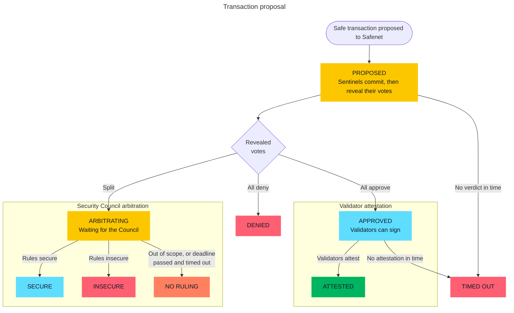

# Transaction Lifecycle

When a Safe transaction is proposed to Safenet, the `Consensus` contract records the proposal and posts a request for it to the oracle named in the proposal. On Safenet that is the `SentinelOracle`, and the arbitration states below only exist for it. Sentinels vote on the request in two steps: each one first commits a hidden vote, then reveals it. If every revealed vote agrees, the oracle approves or denies the request. The validators sign an attestation, in a FROST signing round, only after an approval. If the votes split, the request goes to the Security Council for arbitration. The diagram below shows each state a proposal can reach, labelled and coloured like the status badge the Safenet Explorer shows for it.

Every arbitration outcome is final, and none of them leads to an attestation. Under the [Charter](https://github.com/safe-research/safenet-charter/blob/main/Safenet_Arbitration_Charter.md#council-and-protocol-boundaries) (Article I), a transaction that enters arbitration is not eligible for validator attestation, whatever the ruling. A `SECURE` ruling settles the dispute between the sentinels. It does not let the transaction through. To execute a transaction after arbitration, propose it again in a later epoch, or use the escape hatch: the Safe announces the transaction onchain and, after a delay, can execute it without an attestation for a limited window.

| Badge | Meaning |
| --- | --- |
| `PROPOSED` | The proposal is recorded and the sentinels are voting on it. The verdict arrives when the last sentinel that committed a vote reveals it. If one of them never reveals, the verdict waits until someone finalizes the request after the reveal window. |
| `APPROVED` | Every sentinel that revealed a vote approved. The validators can now sign the attestation. They stop waiting for the verdict after their own timeout, so an approval that arrives later is never signed and the explorer eventually shows it as `TIMED OUT`. |
| `ATTESTED` | The validators attested the transaction onchain. This is the normal successful end. |
| `DENIED` | Every sentinel that revealed a vote denied. The validators do not sign an attestation for it. |
| `TIMED OUT` | Something the explorer expected did not happen within its signing timeout (a setting, in blocks): either no verdict arrived, for example because no sentinel voted or revealed, or an approved proposal was not attested. This is the explorer's own view, not an onchain state, so it changes if a late verdict or attestation arrives. |
| `ARBITRATING` | The sentinels disagreed, so the oracle froze the request. The Security Council can rule on it or decline it. After the deadline block, anyone can time the arbitration out. Until someone does, the Council can still act. |
| `SECURE` | The Security Council ruled the transaction secure. It is still not attested. |
| `INSECURE` | The Security Council ruled the transaction insecure. It is not attested. |
| `NO RULING` | The Security Council declined the request as out of scope, or the deadline passed and someone timed the arbitration out. This is neither a secure nor an insecure ruling, and the transaction is not attested. |
